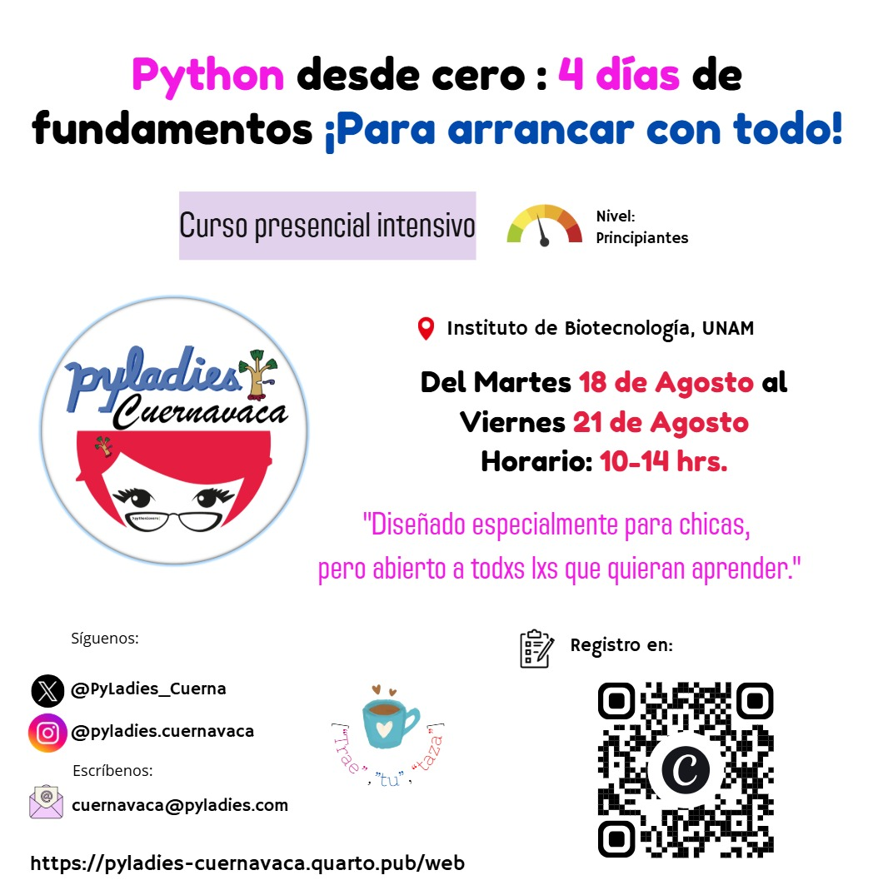

# Python desde cero: 4 días de fundamentos

### ¡Para arrancar con todo!

Curso presencial intensivo organizado por **PyLadies Cuernavaca**.

**18 al 21 de agosto de 2026**

**10:00 a 14:00 hrs.**

**Instituto de Biotecnología (IBt), UNAM**

**Modalidad:** Presencial

**Nivel:** Principiantes

---

## Sobre el curso

Este curso está pensado para quienes desean **iniciarse en Python desde cero** y adquirir, a lo largo de cuatro días de trabajo práctico, los fundamentos esenciales de programación.

Durante las sesiones aprenderemos paso a paso conceptos como:

* Variables y tipos de datos
* Estructuras de datos
* Condicionales
* Ciclos
* Funciones
* Manejo de archivos
* NumPy
* Pandas
* Visualización de datos

También tendremos un primer acercamiento a la **bioinformática con Biopython**, trabajando con **secuencias biológicas** y algunos de los formatos utilizados comúnmente en esta área.

---

## Instructoras

El curso será impartido por integrantes de **PyLadies Cuernavaca**:

* **Dra. Maricela Carrera**
* **M.O.C.A. Edna Cruz F.**
* **M. en C. Wendolyn Estrada**
* **Dra. Alida Zárate**

---

## Material del curso

En este repositorio se compartirán los notebooks, ejercicios y recursos utilizados durante las cuatro sesiones del curso.

Los ejercicios se realizarán principalmente mediante **Google Colab**, por lo que no es necesario tener Python instalado localmente.

El material se irá organizando de acuerdo con las sesiones del curso.

# Presentación del día 1.

En el siguiente link encontrarán las diapositivas del día 1:

👉 *[Ver presentación del día 1: https://pyladies-cuernavaca.quarto.pub/mini-curso_python_dia1](https://pyladies-cuernavaca.quarto.pub/mini-curso_python_dia1)*

---

## Requisitos

Debido a que se trata de un curso **presencial y práctico**, es indispensable asistir con **computadora personal** para realizar los ejercicios durante las cuatro sesiones.

No es necesario contar con experiencia previa en programación ni tener Python instalado.

---

## PyLadies Cuernavaca

¿Quieres conocer más sobre PyLadies Cuernavaca o consultar materiales de nuestras actividades anteriores?

 [**PyLadies Cuernavaca – Recursos**](https://pyladies-cuernavaca.quarto.pub/web)

Nuestros eventos están **abiertos a personas de todos los géneros** que quieran aprender y compartir en un ambiente respetuoso, diverso e inclusivo.

### Síguenos

* **Twitter/X:** @PyLadies_Cuerna
* **Instagram:** @pyladies.cuernavaca
* **GitHub:** [PyLadies-Cuernavaca](https://github.com/PyLadies-Cuernavaca)
* **YouTube:** @pyladiescuernavaca
* **Correo:** [cuernavaca@pyladies.com](mailto:cuernavaca@pyladies.com)

---

## Licencia

Los materiales educativos de este repositorio se distribuyen bajo la licencia **Creative Commons Attribution-NonCommercial-ShareAlike 4.0 International (CC BY-NC-SA 4.0)**.

Esto permite compartir el material con fines no comerciales, siempre que se otorgue el crédito correspondiente a **PyLadies Cuernavaca y a las autoras originales**, y que las obras derivadas se distribuyan bajo la misma licencia.

Consulta el archivo [`LICENSE`](LICENSE) para más información.

---

  

---

**PyLadies Cuernavaca 💜**
